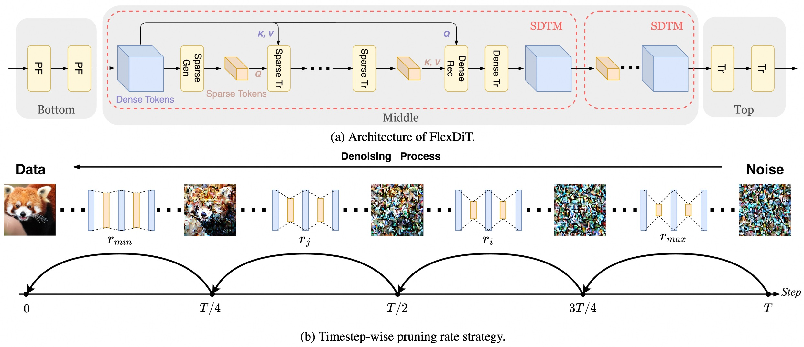
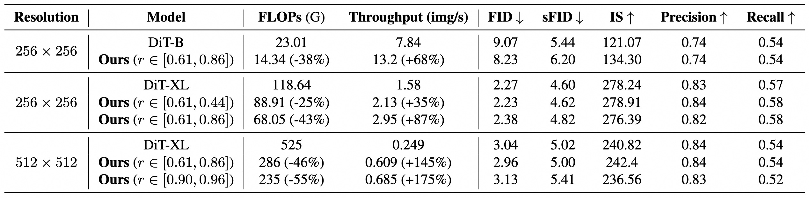
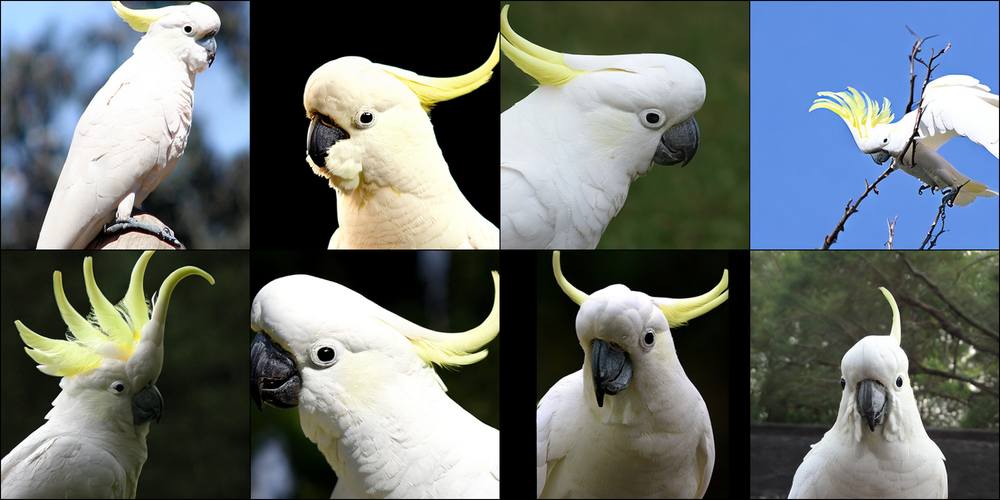

## SparseDiT: Token Sparsification for Efficient Diffusion Transformer (NeurIPS 2025)<br><sub>Official PyTorch Implementation</sub>

### [Paper](https://arxiv.org/abs/2412.06028) by Shuning Chang, Pichao Wang, Jiasheng Tang, Fan Wang, Yi Yang. 

#### The code is based on [DiT](https://github.com/chuanyangjin/fast-DiT).
#### Both training and inference code is available!
#### The code contains the implementation of SparseDiT network without timestep-wise pruning strategy.


## Results on ImageNet-1K


## Visualization on 512x512





# Environment

First, download and set up the repo:

```bash
git clone https://github.com/changsn/FlexDiT.git
cd FlexDiT
```

We provide an [`environment.yml`](environment.yml) file that can be used to create a Conda environment.

```bash
conda env create -f environment.yml
conda activate SparseDiT
```

## Data preparation

Pleaset refer to [Fast-DiT](https://github.com/chuanyangjin/fast-DiT) to extract ImageNet vae features and download pre-trained models.

## Training
```
accelerate launch --multi_gpu --num_processes 8 --mixed_precision fp16 train.py --model DiT-XL/2 --pretrained /path/to/pre-trained/model --feature-path /path/to/store/features --image-size 512
```
You can set your hyper-parameters according to my log files.

## Sampling and Evaluation
To evaluate SparseDiT-DiT-XL-512x5112 on ImageNet on N gpus run:

```
torchrun --nnodes=1 --nproc_per_node=N sample_ddp.py --model DiT-XL/2 --num-fid-samples 50000 --image-size 512 --seed 1

```
Above command will 
generate a folder of 50,000 samples as well as a `.npz`. We integrate the codes from [ADM's TensorFlow
evaluation suite](https://github.com/openai/guided-diffusion/tree/main/evaluations) to compute FID, Inception Score and
other metrics, run:

```
python evaluator.py --ref_batch /path/to/reference.npz --sample_batch /path/to/sampling.npz
```
Replace the `/path/to/reference.npz` with VIRTUAL_imagenet512 which you can find in [ADM's TensorFlow
evaluation suite](https://github.com/openai/guided-diffusion/tree/main/evaluations)

## Citation
If you use this code for a paper please cite:

```
@article{chang2024flexdit,
  title={FlexDiT: Dynamic Token Density Control for Diffusion Transformer},
  author={Chang, Shuning and Wang, Pichao and Tang, Jiasheng and Yang, Yi},
  journal={arXiv preprint arXiv:2412.06028},
  year={2024}
}
```
